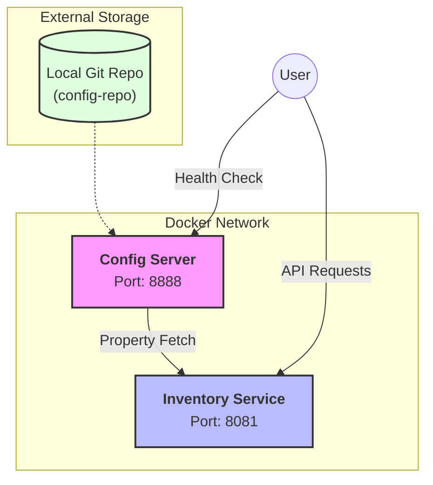

#  Centralized Configuration Microservice

[](https://spring.io/projects/spring-cloud-config)
[](https://spring.io/projects/spring-boot)
[](https://www.docker.com/)

A modern, scalable microservice architecture demonstrating **Centralized Configuration Management** using Spring Cloud Config. This project allows you to manage application settings across different environments dynamically without service restarts.

---

## 🏗️ Architecture Overview

The system consists of a Config Server that serves properties from a local Git repository to client microservices.



---

##  Key Features

- **Centralized Config**: Single source of truth for all microservice configurations.
- **Git-Backed**: Configuration is versioned and managed in a Git repository.
- **Dynamic Refresh**: Update application properties at runtime without restarting services using `@RefreshScope`.
- **Health Monitoring**: Custom health indicators to monitor connectivity between services.
- **Dockerized**: Fully containerized environment for easy deployment and scaling.

---

##  Project Structure

```text
centralized-config-service/
├── config-server/             # Spring Cloud Config Server
│   ├── src/
│   └── Dockerfile
├── inventory-service/         # Client Microservice
│   ├── src/
│   └── Dockerfile
├── config-repo/               # Git repository for configuration files
│   └── inventory-service-dev.yml
├── docker-compose.yml         # Orchestration for containers
└── README.md                  # Project documentation
```

---

##  Getting Started

### Prerequisites
- Docker & Docker Compose
- Java 21 (for local development)
- Maven (for local development)

###  1. Clone/Pull and Prepare
Ensure your local `config-repo` is initialized as a Git repository:
```bash
cd config-repo
git init
git add .
git commit -m "initial config"
```

###  2. Start with Docker
The easiest way to run the entire stack is using Docker Compose:

```bash
docker-compose up --build -d
```
*This will build the images for both services and start them in the background.*

###  3. Updating Configuration (Dynamic Refresh)
1. Modify `config-repo/inventory-service-dev.yml`.
2. Commit the change: `git commit -am "update logic"`
3. Trigger a refresh in the client:
   ```bash
   curl -X POST http://localhost:8081/api/inventory/refresh
   ```
4. Verify the update:
   ```bash
   curl http://localhost:8081/api/inventory/config
   ```

---

##  API Documentation

### Inventory Service (`8081`)

| Method | Endpoint | Description |
| :--- | :--- | :--- |
| `GET` | `/api/inventory/health` | **Custom Health Check** (Status & Config Server link) |
| `GET` | `/api/inventory/config` | View current loaded configuration properties |
| `POST` | `/api/inventory/refresh` | Trigger dynamic configuration refresh |
| `GET` | `/actuator/health` | Standard Spring Actuator health endpoint |

### Config Server (`8888`)

| Method | Endpoint | Description |
| :--- | :--- | :--- |
| `GET` | `/actuator/health` | Config Server health status |
| `GET` | `/{app}/{profile}` | Raw configuration fetch (e.g., `/inventory-service/dev`) |

---

##  Testing the Health Check
The custom health check provides a sleek, flat JSON response:

**Request:** `GET http://localhost:8081/api/inventory/health`

**Response:**
```json
{
    "status": "UP",
    "configServer": "connected"
}
```

---

